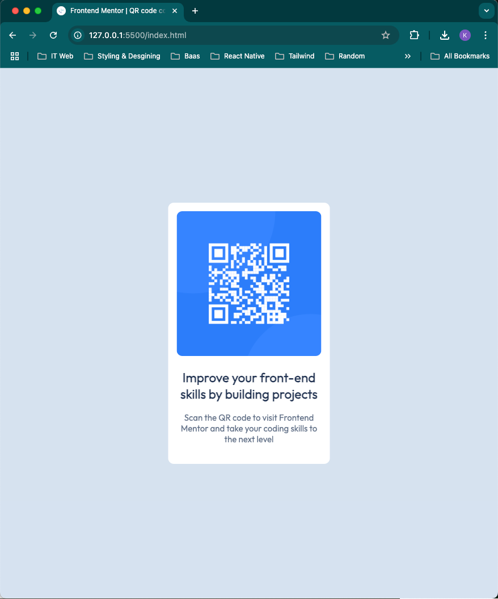

# Frontend Mentor - QR code component solution

This is a solution to the [QR code component challenge on Frontend Mentor](https://www.frontendmentor.io/challenges/qr-code-component-iux_sIO_H). Frontend Mentor challenges help you improve your coding skills by building realistic projects. 

## Table of contents

- [Overview](#overview)
  - [Screenshot](#screenshot)
  - [Links](#links)
- [My process](#my-process)
  - [Built with](#built-with)
  - [What I learned](#what-i-learned)
  - [Continued development](#continued-development)
  - [Useful resources](#useful-resources)
- [Author](#author)
- [Acknowledgments](#acknowledgments)


## Overview
This project is to rehearse knowledge in using HTML and CSS.
### Screenshot



### Links

- Solution URL: [Click here](https://github.com/niophan/qr-code-fe/tree/main)
- Live Site URL: [Click here](https://niophan.github.io/qr-code-fe/)

## My process

### Built with

- Semantic HTML5 markup
- CSS custom properties
- Mobile-first workflow


### What I learned

While working through this project i recap of how to center the div-container without using flexbox or grid. 

```css
.container {
  background: hsl(0, 0%, 100%);
  padding: 15px;
  width: 285px;
  height: 460px;
  border-radius: 10px;
  position: absolute;
  top: 50%;
  left: 50%;
  transform: translate(-50%, -50%);
}
```


### Continued development

Under construction....

### Useful resources

- [Box-sizing](https://developer.mozilla.org/en-US/docs/Web/CSS/box-sizing) - This helped me for adjusting the total woidth and height of an element. I really liked this pattern and will use it going forward.


## Author

- Frontend Mentor - [@niophan](https://www.frontendmentor.io/profile/niophan)
- Github - [@niophan](https://github.com/niophan)


## Acknowledgments

Thanks Frontend Mentor for this challenge.
